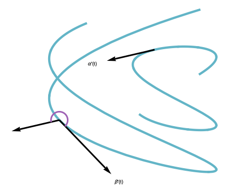

# latex相关软件
应用latex 来渲染数学公式  
需要安装mactex  
然后安装readme2tex:  
git clone git@github.com:leegao/readme2tex.git  
python setup.py develop  
运行add-git-hook并不好用  
直接用 rm -r svgs  
python -m readme2tex --output README.md INPUT.md --nocdn
# 写在前面
 这是我阅读differetial geometry的阅读笔记主要是习题和mathematica的应用。
 
 
 其中q是切线方向Jq是q的法线方向，p是q的导数向量。

上面ParametricPlot是画曲线的函数。
对于曲线研究至关重要研究弧长公式：  

$$length[\alpha] = \int_{a}^{b}\left|\left|\alpha'[t]\right|\right|dt$$

上面公式的计算是通过
$$l[[\alpha], P]=\sum_{i=1}^{N}\left|\left|\alpha(t_{j})-\alpha(t_{j-1})\right|\right|$$
当N趋近于无穷的计算结果。

关于曲线夹脚的计算：
对于$R^{2}$空间的曲线$\alpha(t),\beta(t)$定义在$interval(a,b)$,对于$t_0,a<t_0<b$,曲线$\alpha(t),\beta(t)$的夹角$\theta_0$满足：$$\frac{\alpha'(t_0)\bullet\beta'(t_0)}{\left|\left|\alpha'(t_0)\right|\right|\left|\left|\beta'(t_0)\right|\right|}=cos(\theta_0)$$$$\frac{\alpha'(t_0)\bullet{J\beta'(t_0)}}{\left|\left|\alpha'(t_0)\right|\right|\left|\left|\beta'(t_0)\right|\right|}=sin(\theta_0)$$
示例图如下：

