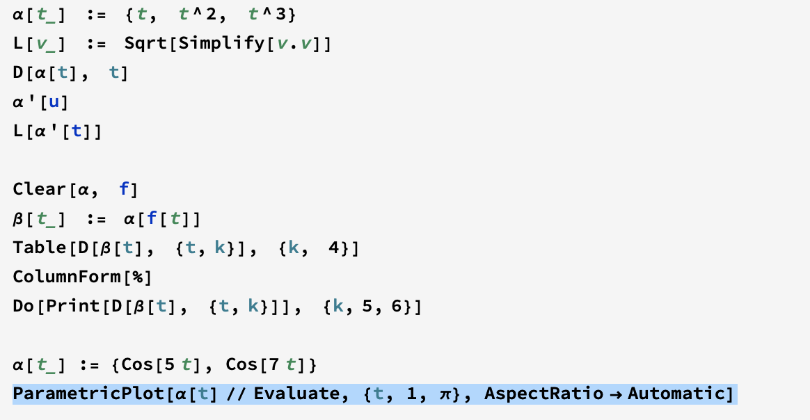

#书写工具
我用latex来书写数学工具
软件安装
brew cast install mactex
sudo pip install readme2tex
python -m readme2tex --output README.md --branch svgs --usepackage tikz INPUT.md --add-git-hook --nocdn
# 写在前面
 这是我阅读differetial geometry的阅读笔记主要是习题和mathematica的应用。
 
 
 其中q是切线方向Jq是q的法线方向，p是q的导数向量。

上面ParametricPlot是画曲线的函数。
对于曲线研究至关重要研究弧长公式：  

$$length[\alpha] = \int_{a}^{b}\left|\left|\alpha'[t]\right|\right|dt$$

