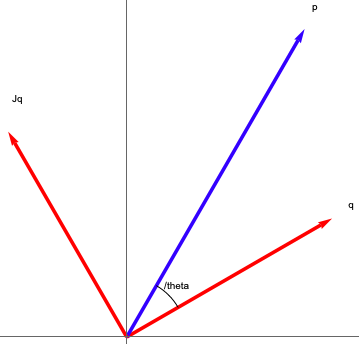
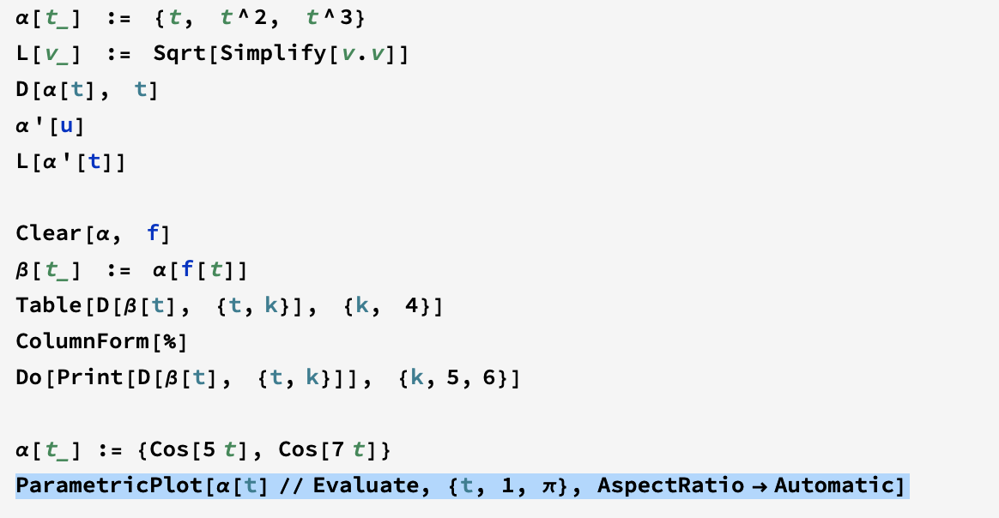

<link rel="stylesheet" href="https://cdn.jsdelivr.net/npm/katex@0.10.2/dist/katex.min.css" integrity="sha384-yFRtMMDnQtDRO8rLpMIKrtPCD5jdktao2TV19YiZYWMDkUR5GQZR/NOVTdquEx1j" crossorigin="anonymous">

# 写在前面
 这是我阅读differetial geometry的阅读笔记主要是习题和mathematica的应用。
 
 
 其中q是切线方向Jq是q的法线方向，p是q的导数向量。

上面ParametricPlot是画曲线的函数。
对于曲线研究至关重要研究弧长公式：

$$length[\alpha] = \int_{a}^{b}\left|\left|\alpha'[t]\right|\right|dt$$

