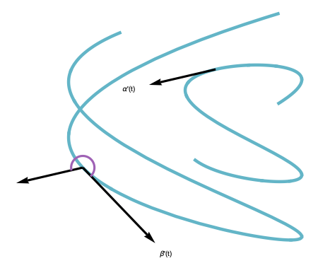

# latex相关软件
应用latex 来渲染数学公式  
需要安装mactex  
然后安装readme2tex:  
git clone git@github.com:leegao/readme2tex.git  
python setup.py develop  
运行add-git-hook并不好用  
直接用 rm -r svgs  
python -m readme2tex --output README.md INPUT.md --nocdn
# 写在前面
 这是我阅读differetial geometry的阅读笔记主要是习题和mathematica的应用。
 
 
 其中q是切线方向Jq是q的法线方向，p是q的导数向量。

上面ParametricPlot是画曲线的函数。
对于曲线研究至关重要研究弧长公式：  

上面公式的计算是通过

当N趋近于无穷的计算结果。

关于曲线夹脚的计算：
对于空间的曲线定义在,对于,曲线的夹角满足：

示例图如下：

更新一个我非常喜欢的曲线指数螺旋线

